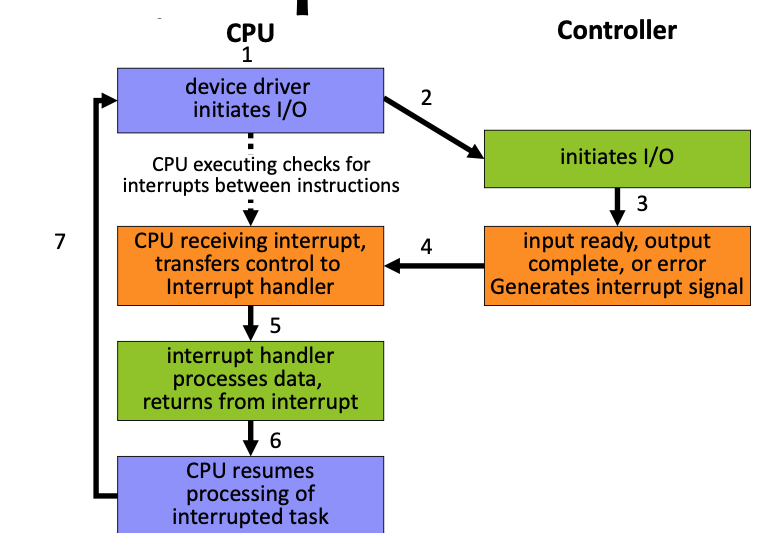

## Definition
- Resource Allocator - manages and allocates resources
  *goal: ensures efficiency, fairness, and security*
- Control Program - execution of user programs, operation of I/O devices
  *goal: prevent errors and improper use*
> OS, as a system API, is the only interface between user applications and hardware

## Computer System Organization
- CPUs
- Device controllers
- Interconnect of CPUs, devices, and memory
*goal: concurrent execution of CPU & devices competing for memory cycles*

## Bootstrapping - powering up
- CPU's initial program in firmware
- do enough to load in the OS kernel
- require a bootloader whether run directly from flash memory or copying OS image to RAM
- After bootstraping, jump to starting point of OS

## Computer System Operation
- device controller 
	- may be designed for different device type
	- outside of process
	- take care of communication through bus
- use **interrupt request (IRQ)** to send notification to CPU
- ways of programing device
	- Polling: Busy / Wait Output - simplest but inefficient
	- interrupt I/O: **interrupt service routine ISR** - upon data ready, CPU jumps to subroutine

## Interrupt: hardware & software
### Hardware interrupt
- someone asserting in IRQ line
- interrupt vector is an array of addresses of ISRs
	- indexed by the interrupt number
	- interrupt number is associated with a hardware source of IRQ
### Software interrupt (aka trap)
- caused by error
- system call which trap is passed as a parameter
## Common Functions of Interrupts

