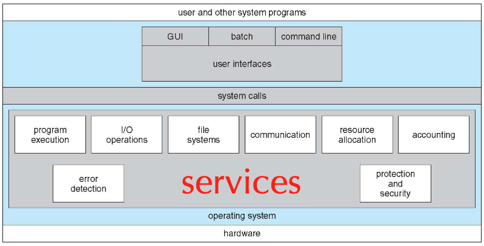

### User Interfaces
- CLI, GUI
- shell - two approaches
	1. understand all commands
	2. invokes executable file

## Application-OS Interface
### System Calls
Function calls to request OS services - traps to kernel.
- Process control
- File management
- Device management
- System setting and context
- Communication
`fork()` - create process
`exec()` - load program into process
Generally done as assembly

### API
set of library calls, with or without system calls
### Why use API?
- Simplicity
- Portability
- Efficiency
## Run-time Environment
- suite of software to run application
- support for system calls - provides calling interface

### Ways of passing parameters to system call
1. in registers
2. in Table - store params in a table in memory, pass the table address in register
3.  on stack

## System Programs (aka services, utilities)
A layer of programs above system calls, for purpose of
- convenience for program development and execution
- define most users' view of OS

## System Structure
OS should be...
- User Goals - easy to use and learn, reliable, safe, and fast
- System Goals - easy to design, implement, maintain, reliable, error-free, and efficient
