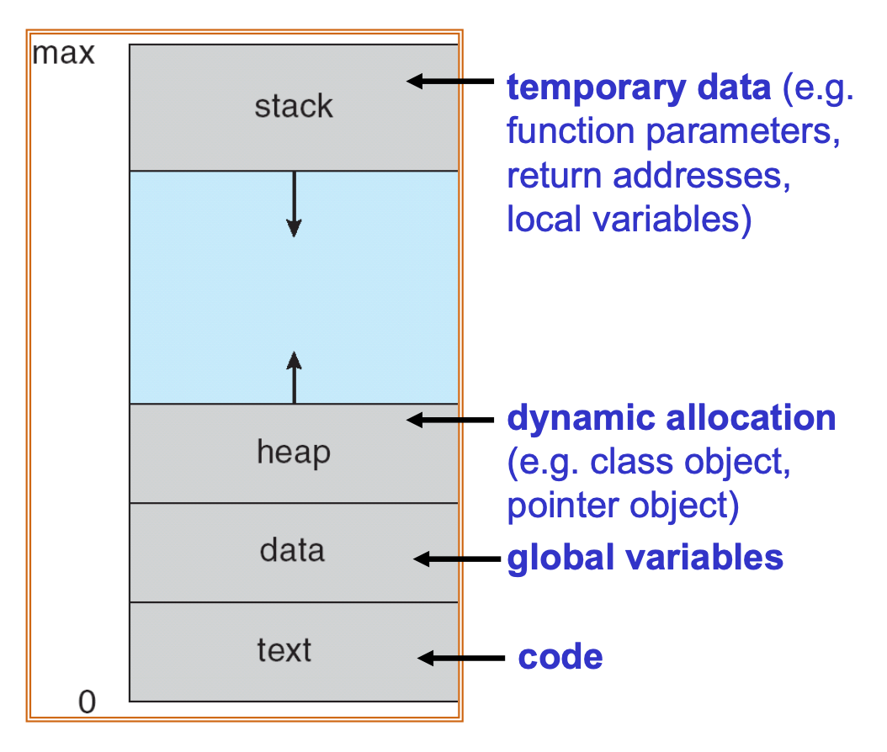

 # Chapter 1

## 1.2 Computer-System Organization

### Terms
- **bootstrap** - initial, powering up
- **EEPROM** - electrically erasable programmable read-only memory
- **daemon** - a program that runs continuously as a background process and wakes up to handle periodic service requests
- **SBUF** - Serial Data Buffer
- **DMA** - Direct Memory Access
- **SDCC** - Small Device C Compiler
### Process of starting a OS
1.  The **bootstrap program** must know how to load the operating system and how to start executing that system.
2. Once the **kernel** is loaded and executing, it can start providing services to the system and its users.
3. Some services outside of the kernel become **system processes**, or **system daemons**
### What comes next
1. The occurrence of an event is usually signaled by an **interrupt** from either the hardware or the software.
	- hardware - send signal to CPU
	- software (aka **trap**) - system call, caused by error
	
2. When interrupted, it immediately transfers execution to a **fixed location**.
	- usually contains the starting address where the service routine for the interrupt is located.
3. The interrupt service routine executes; on completion, the CPU resumes the interrupted computation

### Interrupts - common functions
1. must transfer control to the appropriate interrupt service routine.
2. **Interrupt-specific handler** - invoke a generic routine to examine the interrupt information
3. **Interrupt vector** - a table of pointers to interrupt routines can be used instead to provide the necessary speed.
## Quiz 2
### Main Points
- Two major approaches to a shell
	1. understand all commands
		- efficient per command, bigger shell
		- to add commands need to modify the shell
	2. invoke executable file
		- smaller, heavier weight per command
		- expandable, no need to modify shell to add command
- The purpose of a **system call** is for a *user program* to request an OS service to be performed in kernel mode.
- **System call number** is passed in a **register** to indicate what service to request.
- Difference between system calls and API - many math API's don't need system call
- a system call traps to kernel and is common written in assembly code.
- Principle of separation between policy and mechanism
	- Policy - What will be done? What is allowed?
	- Mechanism - How to do it?
> it allows maximum flexibility if policy decisions are to be changed later
- Monolithic kernel
	- lower overhead compared to microkernel 
	- but hard to scale unless organized in a modular structure.
- IPC, a function of a microkernel, is done in kernel mode.
- A **microkernel** can run an OS service in `user mode` while also protecting the rest of the system if each service runs in its own address space and cannot affect the rest of the system 
- `__interrupt(4)` as a suffix of an ISR declaration associates the ISR with the *interrupt vector* for UART and uses RETI for return
- The `lcall` instruction calls a subroutine located at the specified address.
- the difference between a program, process, job, and task
	- A **process** is an isolated entity of Operating System. 
	- A **task** may be called a process if it is a single task. 
	- A **job** may be called a task if the job to be performed is a single unit of work. 
	- A **process** or group of processes can be termed as a task and a group of tasks can be termed as a job.
- A program is the static executable, while a process is an instance of program in execution.
- the sections of memory of a process
	- the _stack_ section contains auto-local variables of functions, parameters passed to a function call, and return address
	- 
- process state
	
- context switch - triggered by an interrupt of a system call
- `fork()` - duplicate the address space from the executable file specified by the params
- process termination - a process implicitly calls `exit()` upon return from `main()`
- shared memory vs message passing for interprocess communication
	- shared memory is faster
- bounded-buffer communication
	- in unbounded buffer, the sender never blocks, and the receiver blocks only if the buffer is empty
	- in bounded buffer, the sender is blocked if buffer is full
- **zombie process** - a process that has completed execution (via the exit system call) but still has an entry in the process table
